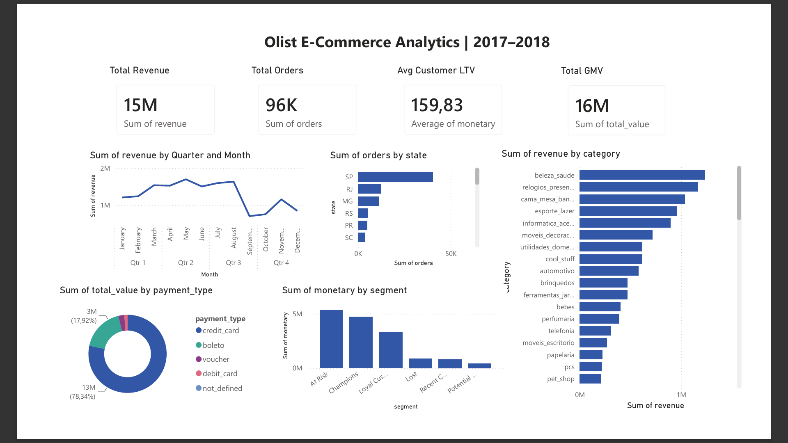

# Olist E-Commerce Analytics / Аналитика E-Commerce Olist

End-to-end analysis of a real Brazilian marketplace - 96K+ orders, SQL with window functions, RFM segmentation, Power BI dashboard.

Полный анализ реального бразильского маркетплейса - 96K+ заказов, SQL с оконными функциями, RFM-сегментация, дашборд в Power BI.

---

## Dashboard Preview / Превью дашборда


---

## What I Did / Что я сделал

**Step 1 - Data Loading / Загрузка данных**
Downloaded 7 real CSV tables from Kaggle (Olist Brazilian E-Commerce dataset) and loaded them into SQLite database using Python + pandas. Total: 96,478 orders, 99,224 reviews, 32,951 products.

Скачал 7 реальных CSV-таблиц с Kaggle и загрузил в базу данных SQLite через Python + pandas. Итого: 96,478 заказов, 99,224 отзывов, 32,951 товар.

**Step 2 - SQL Analysis / SQL-анализ**
Wrote 10 analytical queries of increasing complexity - from basic aggregations to window functions, CTEs, and RFM segmentation. Exported aggregated results to Excel for Power BI.

Написал 10 аналитических запросов разной сложности - от базовых агрегаций до оконных функций, CTE и RFM-сегментации. Экспортировал агрегированые данные в Excel для Power BI.

**Step 3 - Power BI Dashboard / Дашборд в Power BI**
Built interactive dashboard with 6 visualizations: revenue trend, top categories, customer segments, payment methods, geographic breakdown and KPI cards.

Построил интерактивный дашборд с 6 визуализациями: тренд выручки, топ-категории, сегменты клиентов, способы оплаты, география, KPI-карточки.

---

## Key Insights / Ключевые инсайты

**Revenue & Growth / Выручка и рост**
- $15.4M total GMV across 96K orders in 2017-2018 / $15.4M общего GMV за 96K заказов в 2017-2018
- Revenue grew ~3.5x from January 2017 to November 2018 / Выручка выросла в ~3.5 раза с января 2017 по ноябрь 2018
- Average order value: $159.83 / Средний чек: $159.83

**Customer Segments / Сегменты клиентов (RFM)**
- 22,617 "At Risk" customers hold $5.3M LTV - the highest revenue segment / 22,617 клиентов "At Risk" несут $5.3M выручки - крупнейший сегмент по деньгам
- Retention of At Risk customers is the #1 growth lever for this business / Удержание этого сегмента - главный рычаг роста
- Lost customers (16K) represent $875K in unrecovered revenue / Потерянные клиенты (16K) - это $875K недополученной выручки

**Categories / Категории**
- `beleza_saude` (Beauty & Health) leads with $1.23M despite moderate order volume - high avg price drives revenue / Beauty & Health лидирует по выручке ($1.23M) при среднем объёме заказов - за счет высокого среднего чека
- Top 5 categories = ~35% of total revenue / Топ-5 категорий = ~35% всей выручки
- 73 active categories - classic long tail distribution / 73 активных категории - классическое расперделение длинного хвоста

**Geography / География**
- Sao Paulo (SP) accounts for ~42% of all orders - extreme geographic concentration / Сан-Паулу даёт ~42% всех заказов - высокая географическая концентрация
- Expanding to RJ and MG is the clearest geographic growth opportunity / Экспансия в RJ и MG - очевидная возможность для роста

**Payments / Платежи**
- 78% of orders paid by credit card ($12.5M) / 78% заказов оплачено кредиткой ($12.5M)
- 17% use Boleto (Brazilian bank slip) - important for unbanked customers / 17% используют Boleto - важно для клиентов без банковской карты

---

## SQL Highlights / Ключевые SQL-запросы

```sql
-- Monthly revenue trend with MoM growth rate (LAG window function)
-- RFM segmentation using NTILE quartiles
-- Delivery performance by state with late order %
-- Monthly cohort retention with FIRST_VALUE
```

Full queries: [`sql/analysis.sql`](sql/analysis.sql)

---

## Tech Stack / Стек
- **Python** (pandas, sqlite3) - data pipeline / пайплайн данных
- **SQL** (SQLite) - 10 analytical queries / 10 аналитических запросов
- **Power BI** - interactive dashboard / интерактивный дашборд

---

## Project Structure / Структура проекта
```
olist-analysis/
├── load_data.py              # Load CSVs into SQLite / Загрузка в SQLite
├── export_for_powerbi.py     # Prepare data for Power BI / Подготовка для Power BI
├── run_queries.py            # Preview SQL results / Просмотр результатов SQL
├── sql/
│   └── analysis.sql          # 10 SQL queries / 10 SQL запросов
├── data/powerbi/             # Aggregated Excel tables / Агрегированные таблицы
├── screenshots/dashboard.png
└── olist_dashboard.pbix
```

## Dataset / Датасет
[Olist Brazilian E-Commerce](https://www.kaggle.com/datasets/olistbr/brazilian-ecommerce) - real data from Brazil's largest marketplace, 2016-2018 / реальные данные крупнейшего маркетплейса Бразилии, 2016-2018.

## Run Locally / Запуск локально
```bash
python load_data.py           # Load data / Загрузить данные
python export_for_powerbi.py  # Export for Power BI / Экспорт для Power BI
python run_queries.py         # Run SQL analysis / Запустить SQL-анализ
```
